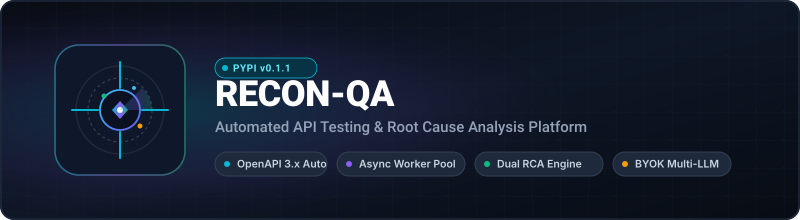
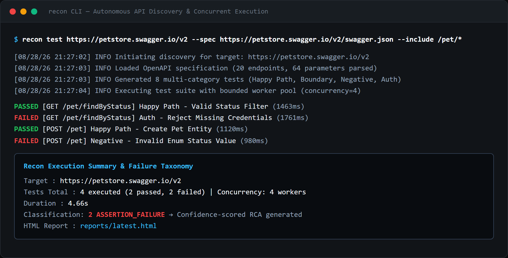
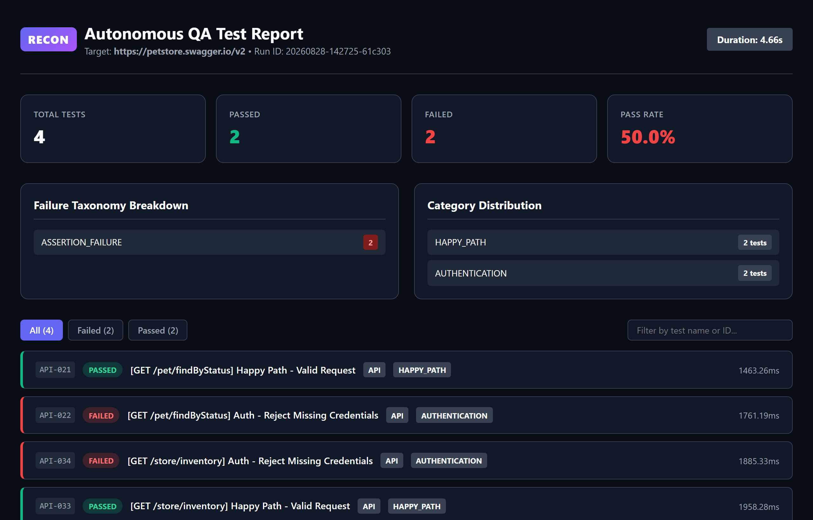

<p align="center">
  
</p>

<p align="center">
  <strong>A Python QA tool that discovers OpenAPI endpoints and web pages, generates API and browser tests, runs them with bounded concurrency, and provides deterministic or optional LLM-assisted failure analysis.</strong>
</p>

<p align="center">
  <a href="https://pypi.org/project/recon-qa/"></a>
  
  
  
  
</p>

---

## Platform Visual Preview

| CLI Test Runner | HTML Report & Failure Analysis |
|:---:|:---:|
|  |  |

---

## Quick Demo

```bash
# 1. Install directly from PyPI
pip install recon-qa

# 2. Run automated test suite against any running API or OpenAPI spec
recon test https://petstore.swagger.io/v2/swagger.json --concurrency 4
```

```text
+-----------------------------------------------------------------------------+
| Recon QA                                                                    |
| Target: https://petstore.swagger.io/v2/swagger.json | Concurrency: 4        |
+-----------------------------------------------------------------------------+
[INFO] Auto-detected OpenAPI specification at swagger.json
[INFO] Generated 24 test cases (Happy Path, Boundary, Validation, Auth)
[INFO] Executing 24 tests with concurrency=4
 PASSED API-001 [POST /v2/pet] Happy Path - Valid Request (42ms)
 PASSED API-002 [GET /v2/pet/findByStatus] Happy Path - Valid Status (38ms)
 FAILED API-003 [POST /v2/pet] Boundary - Empty Body (55ms) - HTTP 400
 PASSED API-004 [GET /v2/user/login] Auth - Valid Credentials (21ms)
 ...
[INFO] Failure analysis:
 ↳ Identified missing required property in payload for /v2/pet (Confidence: 92%)
 ↳ Suggested Fix: Ensure required 'name' and 'photoUrls' fields are provided in request body

+------------------------- Recon Test Run Completed --------------------------+
| Execution Summary                                                           |
|   Total Tests : 24  |  Passed : 22  |  Failed : 2  |  Pass Rate : 91.7%     |
|   HTML Report : reports/run-20260828-095131-1b5354/report.html              |
|   Latest Link : reports/latest.html                                         |
+-----------------------------------------------------------------------------+
```

---

## Architecture & Pipeline

Recon coordinates automated endpoint discovery, test matrix generation, bounded async workers, and dual-layer failure classification.

### End-to-End Execution Flow

```text
Target Application URL / OpenAPI Spec
        │
        ▼
  Discovery Engine ──► OpenAPI 3.x / Swagger Parser & Playwright Crawler
        │
        ▼
  Automatic Auth Setup ──► Schema-driven Registration & Bearer Token Injection
        │
        ▼
  DAG Test Planner & Ordering
        │
        ├── 1. Root Entity Creation (POST endpoints ──► Harvest IDs into StatePool)
        ├── 2. Stateful Query / Detail Operations (Substitute real entity IDs into {params})
        ├── 3. Boundary & Validation Checks (Empty strings, zero values, negative IDs)
        ├── 4. Strict Enum & Schema Violations (Negative type and enum assertion probes)
        └── 5. Security & Error Handling (401/403 credential rejection & 404 handling)
        │
        ▼
  Async Worker Pool (Bounded Concurrency: 4–16 workers)
        │
        ├── API Runner with Dynamic DAG State Substitution
        └── Browser Runner (Playwright headless DOM navigation)
        │
        ▼
  Evidence Collector (HTTP traces, responses, DOM logs)
        │
        ├── Deterministic Failure Classifier (HTTP 4xx/5xx, timeouts, assertions)
        └── AI Root-Cause Analyzer (Fact extraction ──► Hypothesis ──► Suggested Fix)
        │
        ▼
  Self-Contained Interactive HTML Report + JSON Telemetry
```

### Core Services

| Module | Technology | Role |
|---|---|---|
| Discovery Engine | Pydantic v2 + httpx | Auto-detects OpenAPI 3.0, 3.1 & Swagger 2.0 specs |
| Test Planner & DAG | Python 3.12 AST | Generates categorized test matrices with topological dependency ordering |
| State Pool Engine | Thread-Safe StateStore | Harvests created entity IDs and injects them into downstream test routes |
| Authentication Setup | Schema-derived requests | Optional registration/login flow with JWT token extraction |
| Concurrency Pool | `asyncio` + WorkerPool | Bounded parallel test execution (4–16 workers) |
| RCA Engine | Deterministic + LLM | Rule-based failure classification & AI remediation recommendations |
| Reporting | Jinja2 + Tailwind CSS | Standalone interactive HTML reports with assertion step diffs |
| CLI Interface | Typer + Rich | Colorized terminal telemetry and interactive progress meters |

### Implementation Notes

- **Deterministic Results** — Test outcomes come from concrete assertions; optional LLM calls are used only for exploratory cases and failure suggestions.
- **Dependency Ordering** — Creation requests can run before dependent routes, with generated IDs stored in a runtime `StatePool`.
- **Authentication Setup** — Recon can build registration/login requests from discovered schemas and reuse extracted bearer tokens.
- **OpenAPI Constraint Handling** — Generated payloads use schema fields such as `enum`, `minimum`, `maximum`, `minLength`, and common formats.
- **Bounded Worker Pool** — An asyncio queue limits concurrent test execution.
- **Optional LLM Providers** — Gemini, OpenAI, Claude, Mistral, Ollama, DeepSeek, and compatible custom endpoints are supported when configured.
- **Standalone HTML Reports** — Styles, report data, and available screenshots are embedded for offline review.

---

## Features

- **Automated OpenAPI Discovery**: Parses OpenAPI 3.0, 3.1, and Swagger 2.0 schemas into strongly-typed parameter trees.
- **Stateful Chaining (DAG)**: Automatically feeds created entity IDs from `POST` responses into subsequent `GET`, `PUT`, and `DELETE` requests.
- **Authentication Setup**: Optional registration and login flow extracts Bearer JWT tokens when the target schema supports it.
- **Multi-Category Test Suites**: Generates Happy Path, Validation, Boundary, Negative, and Authentication test suites automatically.
- **Asynchronous Execution Pool**: Runs tests in parallel with configurable worker limits (`--concurrency 4-16`).
- **Dual-Layer Root Cause Analysis**: Pairs deterministic HTTP error categorization with confidence-scored AI diagnosis.
- **Optional LLM Analysis**: Supports Gemini, OpenAI, Claude, Mistral, Ollama, and DeepSeek when credentials or local endpoints are configured.
- **Suggested Fixes**: Produces code or payload recommendations for review.
- **HTML & JSON Reports**: Includes execution timing, failure categories, and step traces.

---

## Tech Stack

- **Core Engine**: Python 3.12, Pydantic v2, httpx, asyncio
- **CLI & UX**: Typer, Rich
- **Browser Automation**: Playwright Async
- **Analysis & AI**: Google Gemini, OpenAI, Claude, Mistral, Ollama, DeepSeek
- **Persistence & Reports**: SQLAlchemy, SQLite, Jinja2, HTML5/CSS3
- **Distribution**: PyPI (`recon-qa`)

---

## Getting Started

### 1. Installation

```bash
# Core CLI + AI testing (includes Google Gemini, OpenAI, Claude, Mistral, Ollama)
pip install recon-qa

# With Playwright browser testing support
pip install "recon-qa[browser]"
playwright install chromium
```

### 2. Run Test Suite Against an API

```bash
# Basic test execution with authentication setup and dependency ordering
recon test http://localhost:8000

# With bounded concurrency & custom OpenAPI path
recon test http://localhost:8000 --spec /api/v1/openapi.json --concurrency 8

# With explicit authorization header if using pre-existing static token
recon test http://localhost:8000 --header "Authorization: Bearer <your-token>"

# With AI Root-Cause Analysis enabled
recon test http://localhost:8000 --ai
```

---

## Testing & Quality Assurance

```bash
# Run unit & integration test suites
pytest tests/ -v

# Run with coverage report
pytest --cov=recon tests/
```

---

## License

MIT
