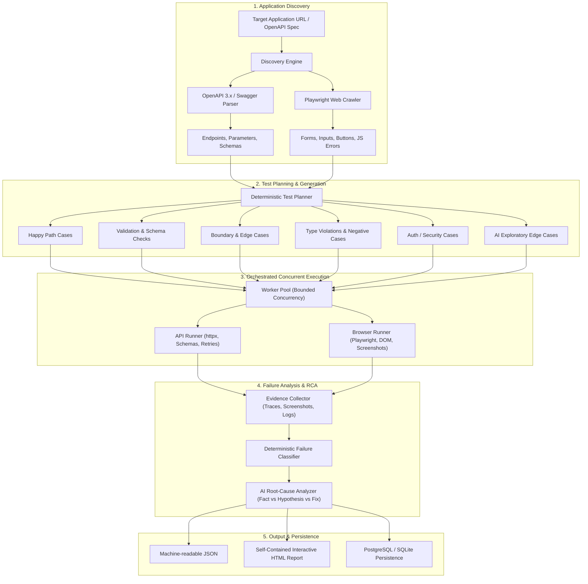

# Recon: AI QA Agent — Autonomous Testing & Failure Analysis Platform

[](https://pypi.org/project/recon-qa/)
[](https://www.python.org/downloads/)
[](https://opensource.org/licenses/MIT)
[](https://github.com/ttnhan227/recon)

> **Recon** (`recon-qa` / `recon`) is an autonomous, developer-first testing platform designed to inspect applications, plan multi-category test suites, execute HTTP & Playwright browser tests concurrently, deterministically classify failures, perform AI-assisted root-cause analysis (RCA), and generate actionable reports.

---

## ⚡ Quick Demo (Proof in Action)

```bash
# 1. Install directly from PyPI
pip install recon-qa[browser,ai]

# 2. Run autonomous test suite against any running API or OpenAPI spec
recon test http://localhost:8000 --concurrency 4
```

```text
+-----------------------------------------------------------------------------+
| Recon AI QA Agent                                                           |
| Target: http://127.0.0.1:8000 | Concurrency: 4 | AI: True                   |
+-----------------------------------------------------------------------------+
[INFO] Auto-detected OpenAPI specification at http://127.0.0.1:8000/openapi.json
[INFO] Generated 24 test cases (Happy Path, Boundary, Validation, Auth)
[INFO] Executing 24 tests with concurrency=4
 PASSED API-001 [POST /api/auth/login] Happy Path - Valid Request (42ms)
 PASSED API-002 [POST /api/orders] Happy Path - Valid Request (38ms)
 FAILED API-003 [POST /api/orders] Boundary - zero quantity (55ms) - Unhandled 500
 PASSED API-004 [GET /api/admin/metrics] Auth - Reject Missing Token (21ms)
 ...
[INFO] Root Cause Analysis Engine:
 ↳ Identified unhandled ZeroDivisionError in orders.py:48 (Confidence: 94%)
 ↳ Suggested Fix: Add input validation for quantity > 0 before price calculation

+------------------------- Recon Test Run Completed --------------------------+
| Execution Summary                                                           |
|   Total Tests : 24  |  Passed : 22  |  Failed : 2  |  Pass Rate : 91.7%     |
|   HTML Report : reports/run-20260828-095131-1b5354/report.html              |
|   Latest Link : reports/latest.html                                         |
+-----------------------------------------------------------------------------+
```

---

## 📸 Visual Preview & Reports

| Autonomous CLI Test Runner | Interactive HTML Report & Root Cause Analysis |
|:---:|:---:|
|  |  |

---

## 1. Architecture Overview



---

## 2. Core Capabilities

- **Deterministic Testing First**: AI is an analysis and exploratory proposal layer, not an unpredictable execution core. Tests execute against concrete assertions (Status codes, JSONPath, JSON Schema, latency, DOM visibility).
- **OpenAPI & Headless Browser Discovery**: Auto-detects and resolves OpenAPI 3.0, 3.1, and Swagger 2.0 schemas, or crawls dynamic Web applications using Playwright to extract forms, interactive buttons, and JavaScript console errors.
- **Multi-Category Test Suites**:
  1. `HAPPY_PATH`: Valid payload matching schemas and expected 200/201 responses.
  2. `VALIDATION`: Missing required property permutations (expected 400/422).
  3. `BOUNDARY`: Empty strings, zero values, negative IDs, and oversized strings.
  4. `NEGATIVE`: Type mismatches (e.g. strings for integer fields, malformed JSON).
  5. `AUTHENTICATION`: Verifies secure endpoints reject unauthenticated requests.
  6. `AUTHORIZATION`: Verifies role-restricted endpoints enforce access controls.
  7. `ERROR_HANDLING`: Verifies non-existent resource IDs return clean 404s.
  8. `EXPLORATORY`: AI-proposed edge cases with strict sandbox validation.
- **Deterministic Failure Taxonomy**:
  - `ASSERTION_FAILURE`
  - `APPLICATION_ERROR` (500 Internal Server Error, unhandled exceptions)
  - `VALIDATION_FAILURE`
  - `AUTHENTICATION_FAILURE`
  - `AUTHORIZATION_FAILURE`
  - `TIMEOUT`
  - `NETWORK_ERROR`
  - `BROWSER_ERROR`
  - `HTTP_ERROR`
  - `TEST_CONFIGURATION_ERROR`
- **AI Root Cause Analysis**: Distinguishes between **Observed Facts**, **Hypotheses** (with confidence score 0.0–1.0), and **Suggested Fixes**.
- **Enterprise Security**: Built-in SSRF protection (blocking cloud metadata IPs `169.254.169.254`, loopbacks unless permitted), response size limits, and automatic secret redaction (`Authorization`, `Bearer`, `Cookie`, passwords, API keys).

---

## 3. Quick Start

### Installation

#### Option 1: Install from PyPI (Recommended)
```bash
pip install recon-qa[browser,ai]

# Install Playwright browser engine
python -m playwright install chromium
```

#### Option 2: Clone from GitHub (Development)
```bash
git clone https://github.com/ttnhan227/recon.git
cd recon
pip install -e .[browser,ai]
python -m playwright install chromium
```

### Verify Environment (`doctor`)

```bash
recon doctor
```

Output:
```
Recon QA Agent — System Diagnostics (Doctor)
Component              Status        Details
Python Version         OK            Python 3.12.10
Playwright & Chromium  OK            Headless Chromium ready
Docker CLI             OK            Found at /usr/bin/docker
Persistence (DB)       OK            sqlite+aiosqlite:///./recon.db
AI Provider (Gemini)   CONFIGURED    Key present: True (Model: gemini-2.5-flash)
```

---

### AI Configuration (Bring Your Own Key)

Recon is **100% Bring-Your-Own-Key (BYOK)**. You can configure and manage keys directly from your terminal or via `.env`:

#### Interactive Terminal Commands (Easiest):
```bash
# 1. View all supported providers and current active model:
recon providers

# 2. Interactively add or update your API key:
recon set-key
# (or specify directly: recon set-key gemini --key AIzaSy...)

# 3. Switch active provider at any time:
recon use mistral
recon use gemini
recon use ollama
```

---

#### Manual `.env` Configuration (Alternative):
Create a `.env` file in the root directory:

#### 1. Google Gemini (Fastest & Free Tier)
```ini
RECON_LLM_PROVIDER=gemini
GEMINI_API_KEY=your_gemini_api_key
RECON_GEMINI_MODEL=gemini-2.5-flash
```

#### 2. Mistral AI
```ini
RECON_LLM_PROVIDER=mistral
MISTRAL_API_KEY=your_mistral_api_key
RECON_MISTRAL_MODEL=mistral-small-latest
```

#### 3. OpenAI
```ini
RECON_LLM_PROVIDER=openai
OPENAI_API_KEY=your_openai_api_key
RECON_OPENAI_MODEL=gpt-4o-mini
```

#### 4. Anthropic Claude
```ini
RECON_LLM_PROVIDER=anthropic
ANTHROPIC_API_KEY=your_anthropic_api_key
RECON_ANTHROPIC_MODEL=claude-3-5-haiku-20241022
```

#### 5. Local Models (Ollama) & Any OpenAI-Compatible API (Groq, DeepSeek, OpenRouter)
```ini
RECON_LLM_PROVIDER=ollama
RECON_LLM_BASE_URL=http://localhost:11434/v1
RECON_LLM_MODEL=llama3.2
```

#### 6. Offline Mock (Default — No API Key Required)
If no key is configured, Recon defaults to `RECON_LLM_PROVIDER=mock` using deterministic rule-based analysis with zero network calls and zero cost.

---

## 4. CLI Reference

Both `recon` and `qa-agent` are available as entrypoints.

### 1. Scan Target Application
```bash
recon scan http://localhost:8000
# or with explicit OpenAPI spec
recon scan http://localhost:8000 --spec http://localhost:8000/openapi.json --browser
```

### 2. Generate Test Plan
```bash
recon generate http://localhost:8000 --output tests.json
```

### 3. Run Autonomous QA Tests
```bash
# Basic run
recon test http://localhost:8000 --browser --concurrency 4

# With authentication / custom headers
recon test http://localhost:8000 -H "Authorization: Bearer <jwt-token>" -H "X-Tenant-ID: workspace-1"

# Target specific endpoints with wildcard filtering
recon test http://localhost:8000 --include "/api/orders*" --exclude "/api/admin*"
```
**Exit Codes:**
- `0`: All tests passed cleanly.
- `1`: Test failures or intentional defects detected.
- `2`: Configuration or unreachable target error.

### 4. Analyze Past Test Results
```bash
recon analyze ./reports/latest.json
# or by run ID
recon analyze 20260828-011000-a1b2c3
```

### 5. View Interactive HTML Report
```bash
recon report latest
```

### 6. Launch Built-in Demo Target
```bash
recon serve-demo --port 8000
```

---

## 5. Built-in Demo Target Application

Recon includes a deliberately defective target application inside the repository (`recon/demo_app/`):

1. **`POST /api/orders`**: Fails with HTTP 500 (`NullReferenceException`) when the optional `currency` parameter is omitted.
2. **`POST /api/users`**: Flawed validation regex rejects valid emails containing numbers.
3. **`GET /api/admin/secrets`**: Missing authorization check exposes sensitive keys without authentication.
4. **`GET /api/slow-analytics`**: Delayed execution (2.0s) triggering latency warnings.
5. **Web UI Login**: Form click produces `Uncaught TypeError: Cannot read properties of undefined (reading 'token')` and fails navigation.

To run Recon against the demo target:

```bash
# Terminal 1: Start demo app
recon serve-demo --port 8000

# Terminal 2: Run Recon with browser automation
recon test http://localhost:8000 --browser --concurrency 4
```

---

## 6. Docker & Docker Compose

Run the entire suite and demo app in Docker:

```bash
docker compose up
```

This starts:
1. `recon-demo-app` on port `8000`
2. `recon-agent` which runs full discovery, test execution, failure classification, and generates HTML/JSON reports in `./reports`.

---

## 7. CI/CD Integration

Example GitHub Actions workflow:

```yaml
- name: Start Target Application
  run: python -m uvicorn recon.demo_app.main:app --port 8000 &

- name: Run Recon QA Agent
  run: recon test http://127.0.0.1:8000 --browser --concurrency 4

- name: Upload Test Report
  if: always()
  uses: actions/upload-artifact@v4
  with:
    name: recon-qa-report
    path: reports/
```

---

## 8. Limitations & Scope

- **Arbitrary Dynamic Endpoints**: Non-standard API endpoints without OpenAPI documentation or HTML links cannot be guessed with 100% certainty. Recon probes standard paths (`/openapi.json`, `/swagger.json`, `/docs`).
- **Complex Multi-Step State**: Endpoints requiring complex state transitions (e.g. 2FA SMS tokens) require pre-configured authentication headers.
- **Heuristic Boundaries**: High-dimensional schemas are fuzz-tested at key boundaries (lengths, zero, null, type mismatch) rather than combinatorial explosion.
